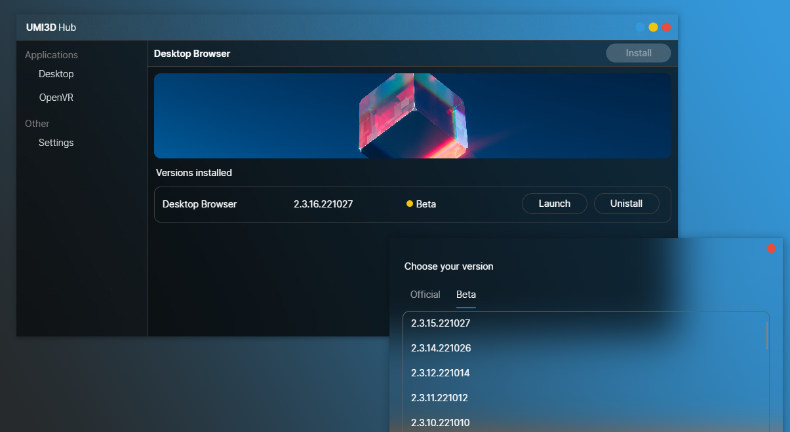

# UMI3D-Hub

UMI3D Hub is a hub to help users download UMI3D Browsers. UMI3D is a web protocol that enables the creation of 3D media in which users of any AR/VR device can collaborate in real time. You can find more information about this sdk on it [repository](https://github.com/UMI3D/UMI3D-SDK).

UMI3D Hub is based on C# and [Avalonia UI](https://avaloniaui.net/).

